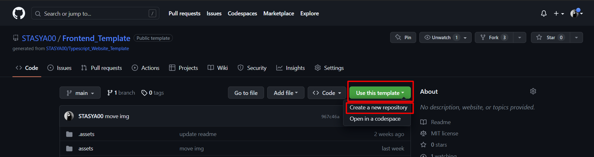
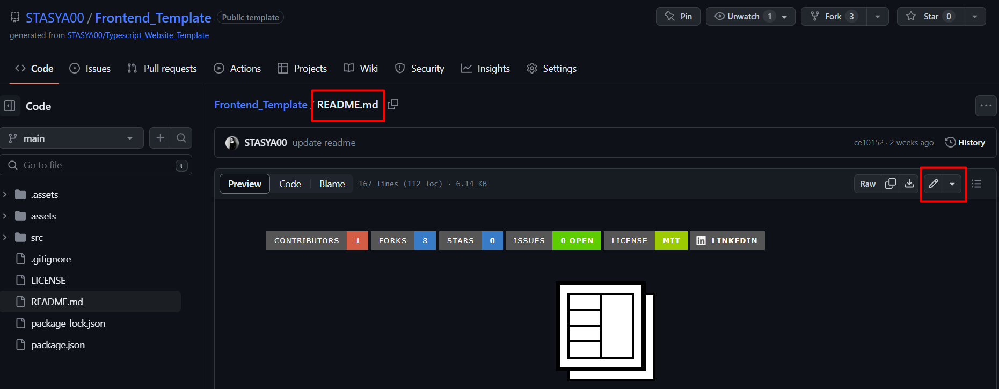
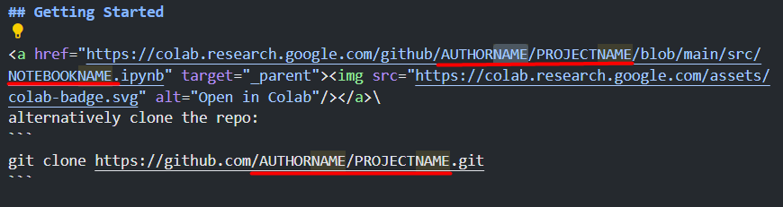
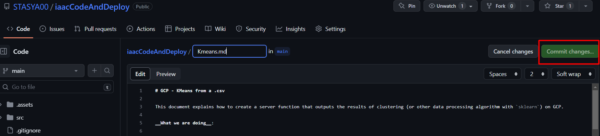
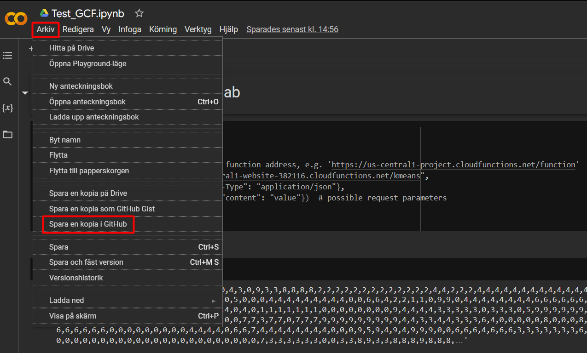
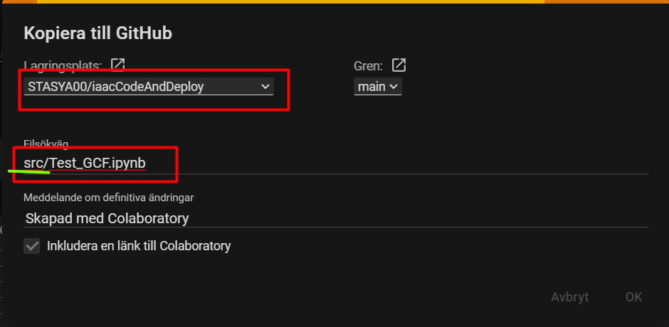

# Project organization

## Intro

It would have been great if everyone could make a website and a demo of their projects - but it's a dream version of this course :wink:. __The MVP__ is for everyone to have a github repo with a project description and a notebook with the code. This way the projects will be presentable to the wider audience and easier to share:star:. We will then collect the projects under a GitHub organization.

## Getting started

### Create a project repo using the template

* Clone the [repo](https://github.com/STASYA00/iaacTemplate) as a template:

* Give it the name of your project (e.g. BeiLink).

## Modify project description

We have made a template ```README``` for the projects. In this way we will have a standardized presentation of the projects and will be able to showcase them on a website in the future. This ```README``` should be filled with information related to your project preserving its original structure.
* Open ```template.md``` in editable mode (either on github or locally):


* Replace all occurencies of:
    * ```AUTHORNAME``` with your github name (e.g. ```gutakroetz```)
    * ```PROJECTNAME``` with the name of your repo (e.g. ```skyview```)
    * ```NOTEBOOKNAME``` with the name of your notebook file (e.g. ```Clustering.ipynb```)

* Fill the section ```About the project``` with the information specific to your project (there are also the instructions for each field, delete them afterwards)
* Upload an illustration of your project into the ```assets``` folder and replace ```main_image.png``` under the section with the name of your file. It can be a Gif!
* __Bonus:__ you can add a video as an illustration of your project. Use drag-and-drop technique described [here](https://medium.com/huawei-developers/how-to-add-an-embedded-video-on-github-readme-file-450f83be157a).
* Write a more extensive description of the project in the section ```Intro```, but not more than 150 words, 2 paragraphs
* In the section ```Built with``` leave only the packages that you used for the projects. ```python3, HTML, Flask, colab, FastAPI``` were used for the server function and the website. In case you used other packages add them underneath the list in the following format: ```* [PACKAGE](LINK)``` 
* Upload your methodology scheme to the ```assets``` folder. In the section ```Methodology``` replace ```methodology.svg``` with the name of your file.
* Section ```Getting started```: make sure all the links (underlined on the image below) are correct, otherwise no need to do anything:

* In the section ```Prerequisites``` write any specific prerequisites that are needed for the project (any specific knowledge, data, access token, website registration, software to download) or leave empty
* In the section ```Usage``` describe how to use the project (e.g. how to import the csv file you used, which cells to run to see which output, which packages to install, where to create an account (e.g. a token for chatgpt ?)). Delete the instruction lines afterwards.
* In the section ```Challenges``` list the challenges you faced during the project (e.g. there's an issue with missing public facilities data in Beirut, instability of image generation from prompts etc.). Delete the instruction lines afterwards.
* In the section ```Future work``` list out the future development of the project, step by step (e.g. deploy the project, add more cities, add support for some feature, add data received from image segmentation to the algorithm etc.). Delete the instruction lines afterwards.
* Leave ```License``` and ```Supervisors``` as they are.
* In the section team:
   * This is a block containing a link (```https://iaac.net```) that should be replaced with a team member's linkedin (or a personal website) and a link to his profile photo (```
            
        </a>
   ``` 
* In the section ```Contact``` check the values underlined with red are correct; replace the values underlined with green with:
    1. your name and surname 
    1. your contact mail

* In case there are more acknowledgements or references that you would like to make, write them in ```More acknowledgements``` section. These could be papers, github projects or repos you have used for this project, smaller packages that were not named above, particular people that contributed to the project, books etc.\
__How to add:__
    ```* [REFERENCE](LINK)``` 
    e.g.
    ```* [IAAC](https://iaac.net/)``` 
* Commit the file


## Add some assets

Now the README has some missing links. These files should be added to the repo - along with all the files needed for the project.

* Add your notebook(s) in the folder ```src```:
    * open your colab notebook, click ```File``` -> ```Save a copy on GtiHub```. Choose the project repo, write the path and the name of how your notebook will be stored. Add ```src``` in the beginning, so that the notebook is stored in this folder.
    
    
    * _alternatively_ upload file from github by clicking on the folder ```src``` -> ```Add file``` -> ```Upload file```, select your notebook in the local system
    
* Add a logo for your project :sunglasses:. Call it ```logo.svg``` and upload to ```assets``` folder. Make sure it visualizes in the ```README```
* Add a project image, the one that illustrates it best. Upload it to ```assets``` folder as ```main_image.png```

* In case you need more images to illustrate your project, feel free to add them to other sections in the ```README```. Images can have different formats, even ```.gif```
    __How to add:__
    Paste this line in the place you want to see your image: \
    ``````
    e.g. for the logo it would be
    ``````

* __Bonus:__ if you want to add a video, go for drag-and-drop from [this article](https://medium.com/huawei-developers/how-to-add-an-embedded-video-on-github-readme-file-450f83be157a)
* Delete the folder ```assets/instructions``` and the file ```instructions.md```. __Make sure you delete only the instruction files.__


## Resources

To learn more about markdown and customize your ```README``` with tables, images, lists, styles and more:

* [Markdown Cheatsheet](https://github.com/adam-p/markdown-here/wiki/Markdown-Cheatsheet)
* [Markdown syntax](https://www.markdownguide.org/basic-syntax/)
* [Emoji markdown](https://gist.github.com/rxaviers/7360908)
* [Video in markdown](https://medium.com/huawei-developers/how-to-add-an-embedded-video-on-github-readme-file-450f83be157a)
